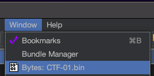
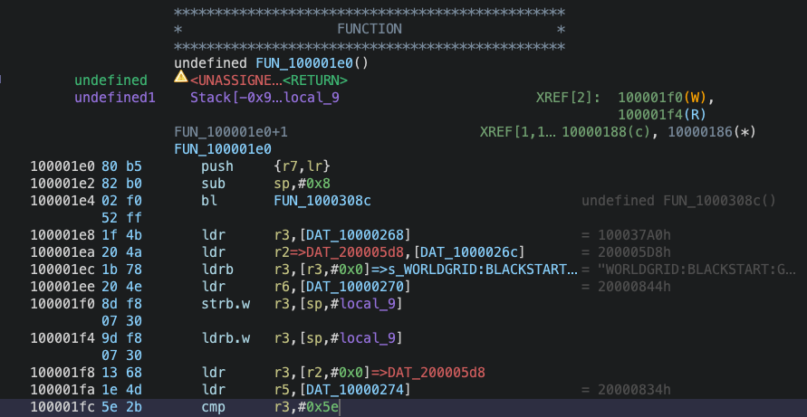
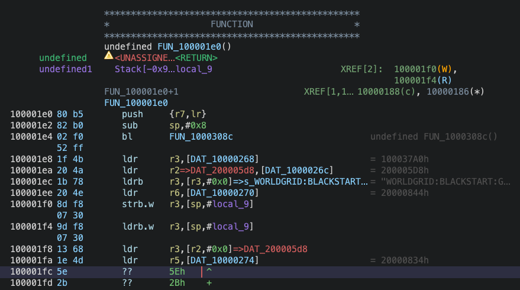
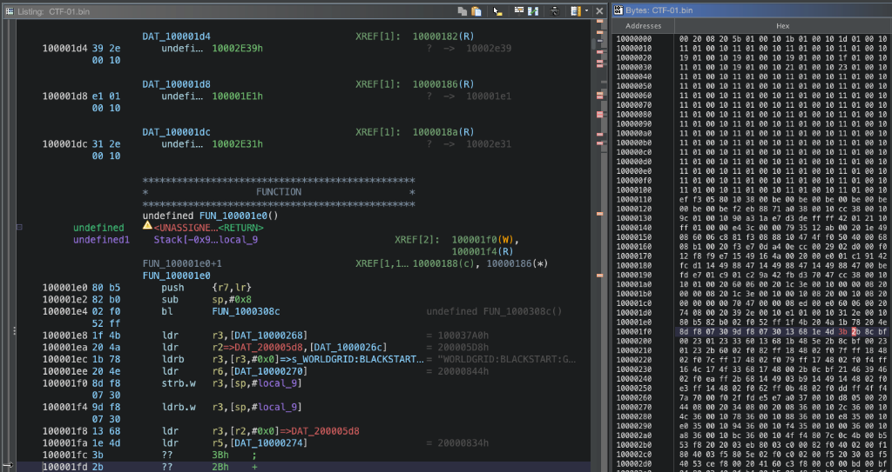
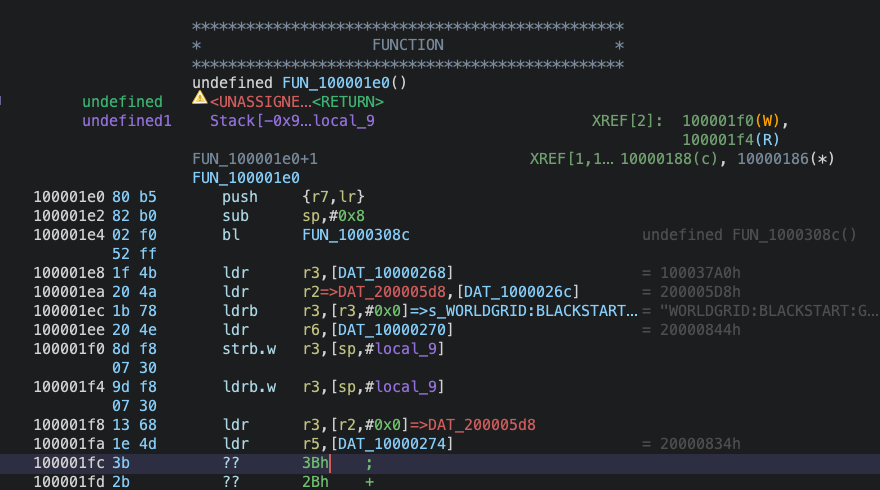

# Ghidra Binary Patching Tutorial: ARM Cortex-M Thumb-2 Bytes Window Workflow

```
+-----------------------------------------------------------------+
|              GHIDRA BYTES WINDOW BINARY PATCHING GUIDE          |
|                                                                 |
|  Target Architecture: ARM Cortex-M33 (ARMv8-M Main / Thumb-2)   |
|  Tool:                Ghidra Software Reverse Engineering Suite |
|  Core Technique:      Listing Clear (C) -> Bytes Window Edit    |
|                       -> Listing Disassemble (D)                |
|  Target Firmware:     Raspberry Pi Pico 2 (RP2350) Raw Binaries |
|  Classification:      Defensive Firmware Security & Patching    |
+-----------------------------------------------------------------+
```

---

## 1. Executive Summary & Overview

Binary patching is a fundamental capability in embedded systems reverse engineering and defensive firmware security. When analyzing compiled firmware images—such as raw binary files (`.bin`) extracted from bare-metal microcontrollers—security analysts and engineers frequently need to modify program logic directly in machine code without access to the original source code or a compilation toolchain.

Common operational scenarios for embedded binary patching include:
- **Defensive Telemetry Correction:** Rectifying corrupted or spoofed sensor thresholds in mission-critical industrial or SCADA control nodes.
- **Vulnerability Remediation & Hot-Patching:** Neutralizing memory corruption flaws, logic bugs, or insecure dispatch routines in deployed firmware.
- **Hardware Reverse Engineering Challenges:** Solving embedded Capture The Flag (CTF) challenges where firmware logic gates must be manipulated to uncover security flags.

While high-level desktop reverse engineering tutorials often recommend right-clicking an instruction and selecting **Patch Instruction**, this GUI action consistently fails when targeting **ARM Cortex-M Thumb-2** binaries. This comprehensive guide documents the underlying architectural reason for this failure and provides the official, step-by-step **Bytes Window Workflow** using high-resolution Ghidra screenshots from live analysis of `CTF-01.bin`.

---

## 2. The Architectural Problem: Why GUI Patching Fails in ARM Thumb-2

### 2.1 The ARM Cortex-M Thumb-2 Instruction Set & IT Blocks

The Raspberry Pi Pico 2 is powered by the dual-core **ARM Cortex-M33** microcontroller, which executes the **ARMv8-M Mainline (Thumb-2)** instruction set. In Thumb-2 mode:
1. Instructions are variable-length: either 16 bits (2 bytes) or 32 bits (4 bytes).
2. Conditional execution is handled via **If-Then (`IT`) blocks** (e.g., `it`, `ite`, `itt`).
3. An instruction immediately preceding an `IT` block sets the Condition Code Flags (e.g., `cmp r3, #0x5e`), and the subsequent `ite hi` instruction evaluates those flags to execute conditionally.

### 2.2 The Context Collision in Ghidra's Disassembler

When you right-click a compare instruction (such as `cmp r3, #0x5e` at offset `0x100001FC`) and select **Patch Instruction** (or press `Ctrl+Shift+G`):

```
+-----------------------------------------------------------------+
|                   GUI PATCH INSTRUCTION FAILURE CHAIN           |
|                                                                 |
|  1. User invokes GUI Patch Instruction at compare site          |
|  2. Ghidra PatchInstructionAction invokes ReDisassembleCommand  |
|  3. ReDisassembleCommand hits subsequent 'ite' block            |
|  4. Ghidra attempts to write internal ITBlock context register  |
|  5. CodeManager throws: ContextChangeException                  |
|  6. Ghidra aborts Thumb decoding -> falls back to 32-bit ARM    |
|  7. Downstream instructions collapsed into movwcs / ldmdavs     |
|  8. Compare Site B (0x1000020A) completely swallowed & lost     |
+-----------------------------------------------------------------+
```

Ghidra maintains internal context registers (such as `TMode` for Thumb execution and `ITBlock` for conditional state tracking). When `ReDisassembleCommand` encounters an existing instruction downstream of the patch site, the context register write collides with existing database state, throwing a `ContextChangeException` (`Context register change conflicts with one or more instructions`).

Because Ghidra's assembler aborts decoding Thumb instructions upon this conflict, it defaults to **32-bit ARM disassembly mode**. It misinterprets the 16-bit Thumb opcode bytes as 32-bit ARM instructions (`movwcs`, `ldmdavs`, `blcs`), which **swallows downstream code** and completely obliterates subsequent compare sites (such as Compare Site B at `0x1000020A`).

### 2.3 Why 'Locking TMode = 1' (Ctrl+R) Does Not Solve the Issue

Attempting to highlight the `.text` section and press `Ctrl+R` (**Set Register Values**) to set `TMode = 1` also fails once Ghidra has already performed its initial auto-analysis. Ghidra's database rules forbid setting context register values across memory ranges that already contain disassembled code.

The clean, permanent, and battle-tested technique is the **Bytes Window Workflow**.

---

## 3. The 5-Step Bytes Window Workflow

The **Bytes Window Workflow** completely bypasses Ghidra's assembler context conflicts. By clearing the single instruction to undefined raw bytes, editing the underlying byte in the hex view, and then disassembling just that location, Ghidra's disassembler operates cleanly without attempting to rewrite `ITBlock` context registers over existing downstream code.

### Step 1: Open the Bytes Window

By default, Ghidra displays the **Listing** view and the **Decompiler** view. To inspect and edit raw hex bytes directly:

1. Look at the top Ghidra menu bar.
2. Click **Window** in the menu.
3. Select **Bytes: <filename>.bin** (for example, **Bytes: CTF-01.bin**).


<p style="text-align: center; font-size: 8.5pt; color: #555; margin-top: -0.05in; margin-bottom: 0.15in;"><em>Figure 1: Navigating to Window -&gt; Bytes: CTF-01.bin in the Ghidra menu bar.</em></p>

4. Dock the **Bytes** window side-by-side with your **Listing** window so both panels are simultaneously visible on your screen.

---

### Step 2: Locate the Target Instruction in the Listing Window

Before making any modifications, navigate to the target function and identify the exact instruction bytes:

1. Click inside the **Listing** window and press key **`G`** (Go To Address).
2. Enter the target address (for example, `0x100001FC`).
3. Observe the disassembled instruction and its opcode encoding:

```assembly
100001fc 5e 2b    cmp    r3,#0x5e
```


<p style="text-align: center; font-size: 8.5pt; color: #555; margin-top: -0.05in; margin-bottom: 0.15in;"><em>Figure 2: Listing view at offset 100001fc showing the initial instruction: cmp r3,#0x5e (bytes 5e 2b).</em></p>

#### Technical Breakdown of Opcode `5e 2b`:
In ARMv8-M Thumb-16 architecture, the compare-immediate instruction `cmp <Rn>, #<imm8>` is encoded as:
- Bit pattern: `0010 1nnn iiiiiiii`
- Opcode field (`00101`): Specifies `CMP` immediate.
- Register `r3` (`nnn = 011` binary): Specifies operand register `r3`.
- Upper byte: `0010 1011` binary = `0x2B`.
- Lower byte: `0x5E` (hex) = `94` decimal (the comparison threshold).
- Because ARM Cortex-M microcontrollers are **little-endian**, the low byte (`5E`) appears first in memory at address `0x100001FC`, followed by the high byte (`2B`) at address `0x100001FD`.
- To change the threshold from $94$ ($0\text{x}5E$) to $59$ ($0\text{x}3B$), we only need to alter byte `0x100001FC` from `5E` to `3B`!

---

### Step 3: Clear the Code Bytes in the Listing Window (`C`)

This is the critical step that prevents assembler context conflicts. Before editing a byte, the instruction must be cleared from Ghidra's active instruction database:

1. In the **Listing** window, click directly on address **`100001fc`** (the row containing `cmp r3,#0x5e`).
2. Press the key **`C`** on your keyboard (or right-click and select **Clear Code Bytes**).
3. Notice that the instruction disassembly immediately clears into undefined raw bytes:

```assembly
100001fc 5e       ??    5Eh    ^
100001fd 2b       ??    2Bh    +
```


<p style="text-align: center; font-size: 8.5pt; color: #555; margin-top: -0.05in; margin-bottom: 0.15in;"><em>Figure 3: Listing view after pressing 'C': the instruction at 100001fc is cleared to raw undefined bytes.</em></p>

By clearing the instruction first, Ghidra's database disarms the active context parser for this address. The subsequent `ite hi` instruction downstream is no longer linked to an active parsing state at this address.

---

### Step 4: Enable Edit Mode and Modify the Byte in the Bytes Window

Now that the address is cleared, modify the raw hex byte using the Bytes window:

1. In the **Bytes** window toolbar, locate and click the **Pencil Icon** (**Toggle Edit Mode**). The icon highlights to indicate that byte-editing mode is now active.
2. Locate offset row **`100001f0`** in the Bytes window.
3. Move your cursor to column **`C`** (representing address `100001fc`).
4. Click on the byte **`5E`** and type the replacement value **`3B`**.
5. Notice that Ghidra immediately updates the byte to `3B` and highlights it in red to indicate an uncommitted edit.


<p style="text-align: center; font-size: 8.5pt; color: #555; margin-top: -0.05in; margin-bottom: 0.15in;"><em>Figure 4: Side-by-side view showing the active pencil icon, the modified byte '3b' highlighted in red in the Bytes window, and the synchronized Listing window.</em></p>

6. Look at the **Listing** window. Address `100001fc` now reflects the new byte `3b` while remaining undefined:

```assembly
100001fc 3b       ??    3Bh    ;
100001fd 2b       ??    2Bh    +
```


<p style="text-align: center; font-size: 8.5pt; color: #555; margin-top: -0.05in; margin-bottom: 0.15in;"><em>Figure 5: Listing view showing the modified byte '3b' at 100001fc ready for disassembly.</em></p>

---

### Step 5: Disassemble the Modified Instruction (`D`)

With the desired byte safely written to memory, restore the disassembly:

1. Click back into the **Listing** window.
2. Click directly on address **`100001fc`**.
3. Press the key **`D`** on your keyboard (or right-click and select **Disassemble**).
4. Ghidra immediately decodes the bytes `3b 2b` as Thumb-2 machine code:

```assembly
100001fc 3b 2b    cmp    r3,#0x3b
```

5. **Verify Downstream Disassembly:** Inspect the instructions immediately following `0x100001FC`:
   - `100001fe 8c bf    ite    hi` remains completely intact!
   - `10000200 00 23    movhi  r3,#0x0` remains intact!
   - `10000202 01 23    movls  r3,#0x1` remains intact!
   - **Compare Site B at `0x1000020A` remains completely intact and visible!**

No context conflict was triggered, no instructions were swallowed, and no 32-bit ARM decoding errors occurred.

---

### Step 6: Repeat for Secondary Sites & Export Patched Firmware

#### Repeating on Compare Site B:
In many defensive patches (such as `CTF-01`), redundant checks or dual comparison gates are enforced by the compiler:
1. In the **Listing** window, click address **`1000020a`** (`cmp r3,#0x5e`).
2. Press **`C`** to clear code bytes.
3. In the **Bytes** window at offset `1000020a`, change byte `5E` to **`3B`**.
4. In the **Listing** window, click back on **`1000020a`** and press **`D`** to disassemble.
5. Both Compare Site A and Compare Site B are now patched to `0x3B` (59 decimal)!

#### Exporting the Patched Binary Image:
1. Click **File** in the Ghidra menu bar.
2. Select **Export Program** (or press key `O`).
3. Set **Format** to **Raw Bytes**.
4. Click the `...` button next to **Output File** and navigate to your project directory.
5. Set the filename (for example, `CTF-01_fixed.bin`).
6. Click **OK** to save the patched binary image to disk.

#### Converting to UF2 and Flashing:
Convert the exported raw binary to the Raspberry Pi Pico 2 UF2 format using `uf2conv.py`:

```bash
python3 uf2conv.py CTF-01_fixed.bin \
  --base 0x10000000 \
  --family 0xe48bff59 \
  --output CTF-01_fixed.uf2
```

Hold the `BOOTSEL` button on your Raspberry Pi Pico 2, plug it into your workstation's USB port, and drag-and-drop `CTF-01_fixed.uf2` onto the `RP2350` drive to verify your patched firmware on physical hardware!

---

## 4. Method Comparison & Reference Guide

```
+-----------------------------------------------------------------+
|              GHIDRA ARM THUMB-2 PATCHING METHODS MATRIX         |
|                                                                 |
|  Method             Downstream Safety   IT-Block Safe   Status  |
|  -----------------  -----------------   -------------   ------  |
|  GUI Patch Inst.    Fails (Swallows)    No (Conflict)   AVOID   |
|  TMode = 1 (Ctrl+R) Fails (Database)    No (Exception)  AVOID   |
|  Bytes Window (C/D) 100% Safe & Clean   Yes (Disarmed)  OPTIMAL |
+-----------------------------------------------------------------+
```

<div style="page-break-before: always;"></div>

### Keystroke Quick Reference Table

| Step | Action | Window | Shortcut / Control | Result |
| :--- | :--- | :--- | :--- | :--- |
| **1** | Open Bytes Panel | Menu Bar | `Window` $\rightarrow$ `Bytes: <bin>` | Displays raw hex grid |
| **2** | Locate Target | Listing | Press `G` $\rightarrow$ enter address | Cursor at target opcode |
| **3** | Clear Code Bytes | Listing | Press `C` | Instruction cleared to `??` |
| **4** | Enable Edit Mode | Bytes | Click **Pencil Icon** | Enables write mode |
| **5** | Modify Hex Byte | Bytes | Type new hex byte (`3B`) | Byte highlighted in red |
| **6** | Re-Disassemble | Listing | Click address $\rightarrow$ press `D` | Reassembles cleanly as Thumb-2 |
| **7** | Export Program | Menu Bar | `File` $\rightarrow$ `Export Program` | Saves patched `.bin` file |

---

## 5. Key Takeaways & Best Practices

1. **Thumb-2 Conditional State is Fragile in Ghidra:** The presence of `IT`/`ITE` blocks creates dynamic context register dependencies. High-level assembler dialogs fail because they attempt to re-evaluate downstream context over existing disassembly.
2. **Clear First (`C`), Edit Second, Disassemble Last (`D`):** Always clear the code bytes before modifying machine code in Ghidra. Clearing breaks the active context dependency graph and allows clean byte substitution.
3. **Always Verify Downstream Code:** After pressing `D`, scan the next 10 instructions to ensure downstream labels, branch targets, and conditional blocks were not disrupted.
4. **Export as Raw Bytes:** When flashing embedded microcontrollers like the RP2350, always export as **Raw Bytes** (`.bin`), never as ELF or PE, before converting to UF2.
